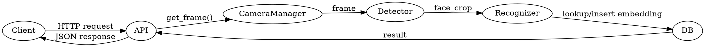

## Tests, Modelization and Test Artifacts

This document explains the testing status, how to run the included examples and tests, and provides a suggested modelization and diagram artifacts to generate for system understanding.

Included test scripts and examples

- `examples/simple_accuracy_test.py` — a test harness for running recognition accuracy trials. Use this to benchmark known models against labeled datasets.
- `examples/demo.py`, `examples/standalone_demo.py`, `examples/simple_demo.py` — various interactive examples to exercise capture and recognition.
- `final_system_test.py` and `test_tkinter.py` — local integration/GUI tests used during development (may require local cameras or sample data).

How to run tests (basic)

1. Activate your virtual environment (see README/INSTALLATION).
2. Run an example:

```powershell
python examples/standalone_demo.py
```

3. Run a small accuracy test:

```powershell
python examples/simple_accuracy_test.py
```

Note: Many tests depend on local camera hardware or pre-existing datasets; if you don't have cameras, run them against recorded videos or mock frames.

Modelization and diagrams

I recommend producing the following artifacts to help visualize and reason about behavior and test coverage:

- Component diagram (shows `api/`, `core/`, `database/`, `models/`, `face-service/`).
- Sequence diagram for a recognition event (client -> api -> camera -> detector -> recognizer -> database -> callback).
- Dataflow diagram for embedding storage and lookup (how embeddings are computed, stored, and compared).

Example Graphviz dot for a sequence diagram (save as `docs/diagrams/recognition_sequence.dot` and convert to PNG):



Suggested tests not included (high priority)

- Unit tests for camera reconnection logic (simulate network outages).
- Unit tests for each recognizer verifying consistent embedding shapes and distance thresholds.
- End-to-end test: feed a recorded video with known identities and assert match rates.
- Regression tests for API endpoints using test client (Flask test client or requests against a local test server).

Metrics to collect during tests

- Latency (frame capture -> match completion)
- CPU/GPU usage per recognizer
- Memory footprint and leaks over a long run
- Accuracy metrics: precision, recall, false positive rate at chosen threshold
